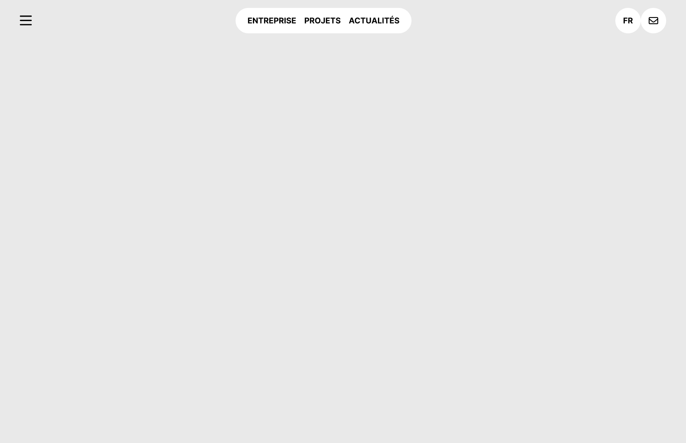

# Exercice hebdomadaire 2

## Installation

1. Cloner le repository
2. Ouvrir le dossier avec Visual Studio Code
3. Ouvrir une fenêtre de terminal dans Visual Studio Code et entrer la commande suivante :

```bash
npm install
```

## Travail

Depuis le terminal, entrer la commande suivante :

```bash
npm run dev
```

## Consigne

1. Ouvrir [la maquette Figma](https://www.figma.com/design/9TkO83ifaNZNipBkrZsUDr/imd2-exercice-hedomadaire-2?node-id=1-2&m=dev) dans l'équipe de votre année
2. Intégrer la maquette aussi précisément que possible, en reprenant les propriétés de Figma
3. Faire un commit, puis un push

## Aperçu de la maquette


